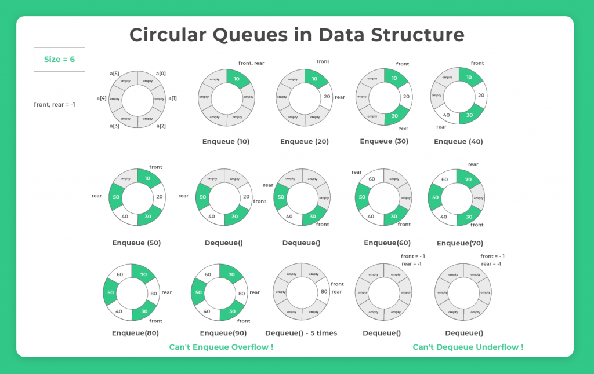

# Stack and Queue

# Stack
---
## Properties
1. **F**irst **I**n **L**ast **O**ut **(後進先出)**
2. Has ***powerful*** impact on computer science!

|||||||4|
|:-:|:-:|:-:|:-:|:-:|:-:|:-:|
|||||**3**||3|
|||**2**||2||2|
|**1**||1||1||1|

## Application
1. **Undo** (Ctrl + z)

|-----------||-----------||-----------||-----------||-----------||--------------||-----------||-----------||--------------|
|:-:|:-:|:-:|:-:|:-:|:-:|:-:|:-:|:-:|:-:|:-:|:-:|:-:|:-:|:-:|:-:|:-:|
|||||||||||||||||**である**|
|||||||||||**深窓の令嬢**||(popped)||**酷い毒舌家**||酷い毒舌家|
|||||||||**は**||は||は||は||は|
|||||||**ひたぎ**||ひたぎ||ひたぎ||ひたぎ||ひたぎ||ひたぎ|
|**羽川**||(popped)||**戦場ヶ原**||戦場ヶ原||戦場ヶ原||戦場ヶ原||戦場ヶ原||戦場ヶ原||戦場ヶ原|
|-----------||-----------||-----------||-----------||-----------||--------------||-----------||-----------||--------------|

2. System Stack (系統棧:中斷向量表)
略 OwO
1. java exception stack trace

## Implementation

``` java
// Below is the fundamental function of Stack
Stack<E>
1. void push(E)
2. E pop()
3. E peek()
4. int getSize()
5. boolean isEmpty()
```

## Complexity analyze

    ArrayStack<T>

    void push(E) $O(1) avg$
    E pop() $O(1) avg$
    E peek() $O(1)$
    int getSize() $O(1)$
    boolean isEmpty() $O(1)$

    All $O(1)$ so happy OwO
    ($avg$ : 均攤)


# Queue

## Properties
1. **F**irst **I**n **F**irst **O**ut **(先進先出)**


## Implementation

``` java
// Below is the fundamental function of Queue
Queue<E>
1. void enqueue(E)
2. E dequeue()
3. E getFront()
4. int getSize()
5. boolean isEmpty()
```

## Complexity analyze

    ArrayStack<T> (implemented with normal array)

    void enqueue(E) $O(1) avg$
    E dequeue() $O(n)$ // maybe... too big...
    E getFront() $O(1)$
    int getSize() $O(1)$
    boolean isEmpty() $O(1)$

## Circular Queue
```java
front == back 表 Queue 空了

(back + 1) % capacity == front 表 Queue 滿了
```

[ref](https://prepinsta.com/data-structures-algorithms/circular-queue/)

