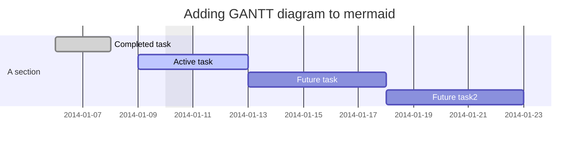
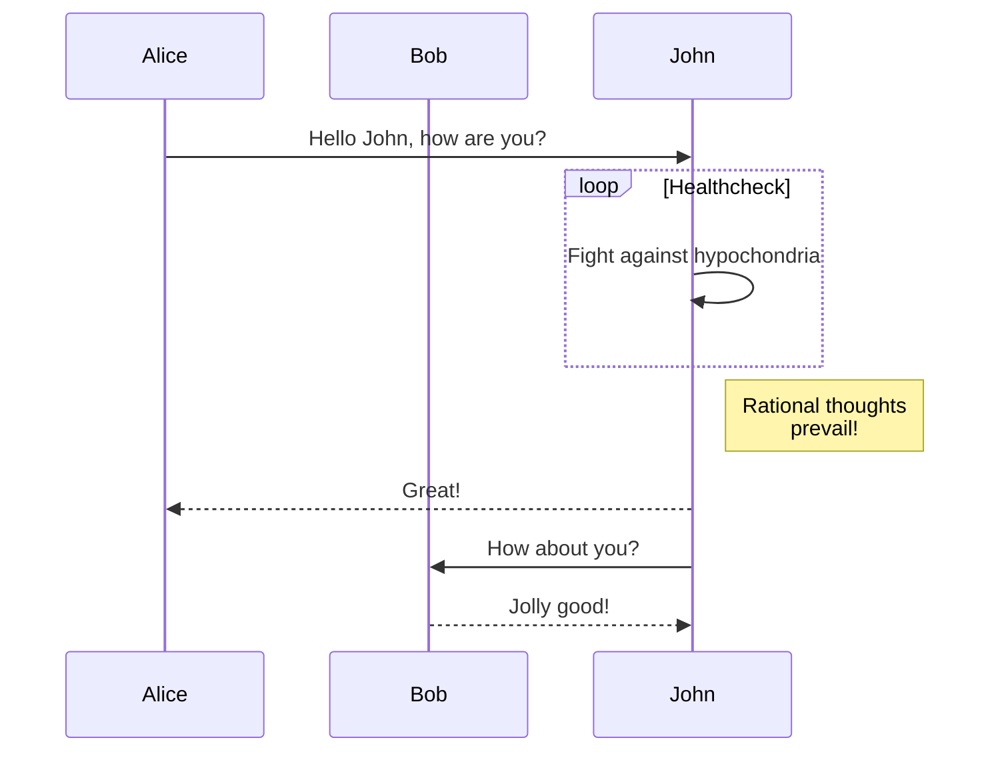
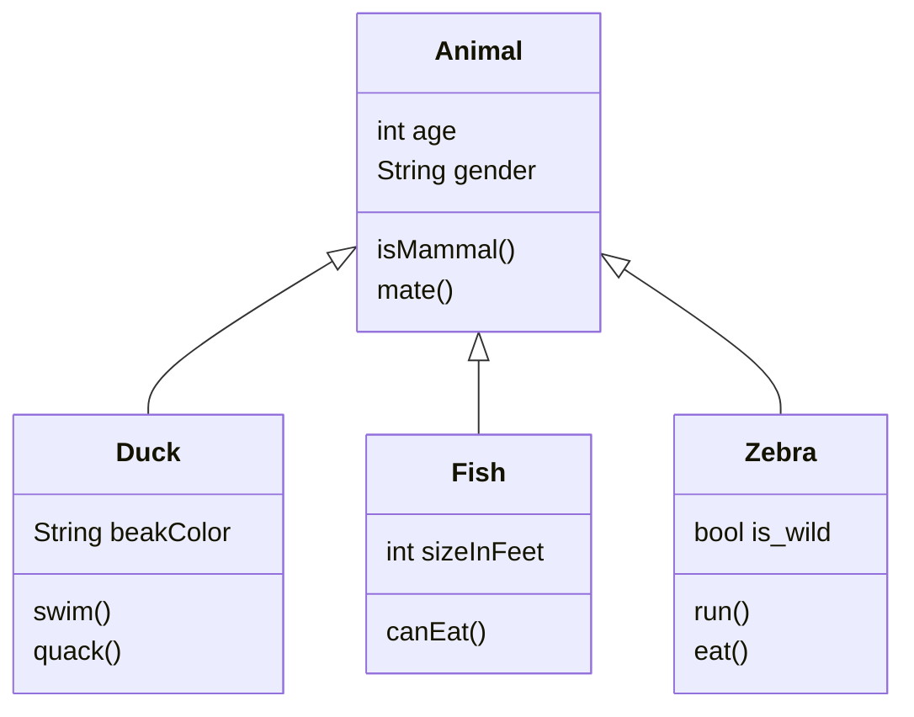
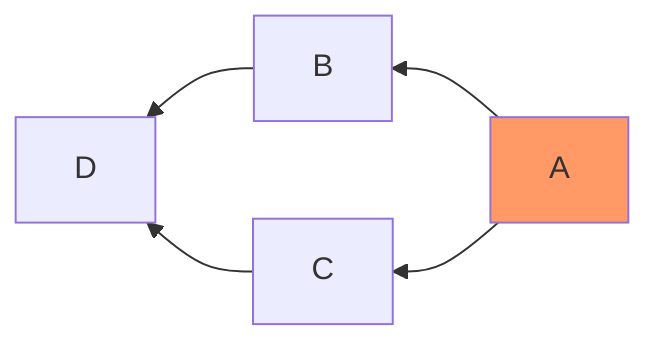

# Wallpaper 搜索器

## Basic info

1. Author : 楊子慶 109502012 資工B
2. (名稱未定) Wallpaper 搜索器
3. 以作品名稱、人物、風格等資訊查詢多個網站的動漫圖片，並且提供畫質篩選、預覽以及下載功能
4. 規劃流程

    1. 基本型
       1. 英文搜尋
       2. AwesomeWallpaper
       3. 1920*1080
       4. 下載 in jpg, png

    2. 基本型強化方案
       1. 支持多種畫質、比例、主體色調篩選
       2. 支持預覽
       3. 在多個圖片網站搜尋 (Zerochan, pixiv, twitter, etc)
       4. Google 圖片搜尋

    3. 進階強化功能
       1. 取個好名字
       2. 內容再強化
          1. 英文、日文、中文 (繁體)、中文 (簡體) 搜尋支持
          2. 全英文、全繁體中文介面
          3. 支持 .webP, .gif (google 圖片)
       3. 新增內容與版本與時俱進功能
          1. 自訂義動漫圖片網站
          2. Github 上傳與更新
          3. Github Pull Request
       4. 新增 ACGN 資料庫
          1. 作品即時資訊搜尋
          2. 尋找可能的資源所在
          3. Torrent 協作下載與管理助理
          4. 動畫字幕查找助理
       5. 新增桌面資料夾管理助理 (心有餘力...)
          1. 提供儲存與桌布使用的自訂義分類模式
          2. 看板娘

## Chart

-|-|-|-
:-:|:-:|:-:|:-:
