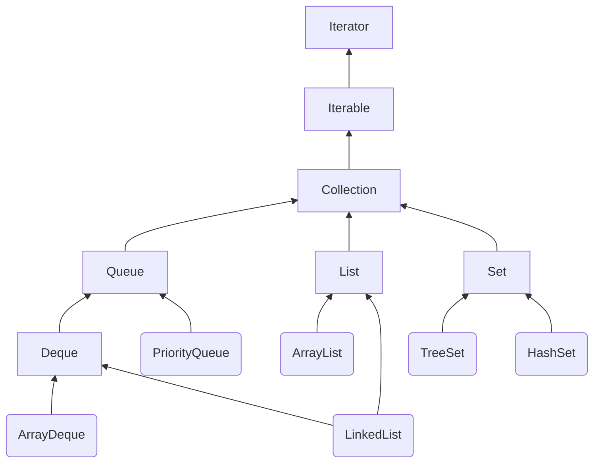
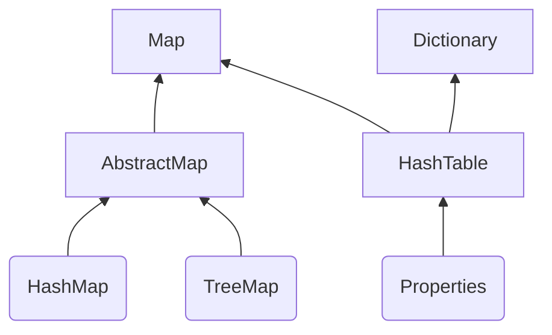
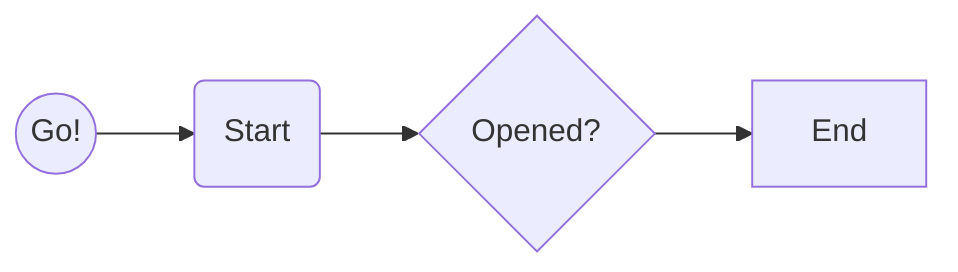

# Collection



*API*|Collection|Iterable|Iterator
:-:|:-:|:-:|:-:
Function|蒐集物件|迭代取得物件|實作迭代器
Example|add(), remove()|iterator()|

*Collection API*|List|Set|Queue|Deque
:-:|:-:|:-:|:-:|:-:
Function|物件有索引|物件不重複|隊列|雙向隊列

**Java 判斷東西是否重複 : 呼叫 $hashCode()$ 以及 $equals()$ --> Java 規格書建議兩者都實作**



1. 其中 Dictionary 以及 HashTable 為老 API，不用為妙，不過 Properties 常用
2. TreeMap 須 key 實作 Comparable 或 建構時指定實作 Comparator 介面的物件


<!-- ```flow
st=>start: Start
e=>end: End
op1=>operation: My Operation
sub1=>subroutine: My Subroutine
cond=>condition: Yes or No?
io=>inputoutput: catch something...
``` -->


